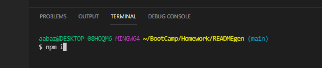
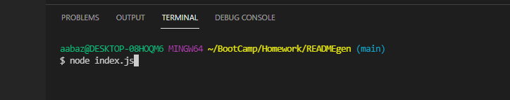
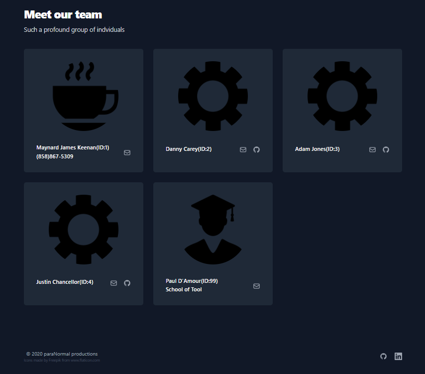

# <ins>Team Profile Generator</ins>

## Description
An app that allows you to create an HTML page based on user input in the integrated terminal. The team consists of a mandatory manager, as well as any number of engineers and interns.
## <ins>Table of Contents</ins>
- [Installation](#installation)
- [Usage](#usage)
- [License](#license)
- [Contributions](#how)
- [Test](#test)
- [Questions](#questions)

## <ins>Installation</ins>
Open the integrated terminal on the index.js file

Type "npm i" in the integrated terminal(if all the files do not install, attempt it again)

## <ins>Usage</ins>
Run the application in the integrated terminal by typing "node index.js". 

Fill out the manager and once prompted with a choice to add another member; either choose an Engineer, Intern or finish your team by selecting None.

Example inputing data:

Example of the page created with the application:

## <ins>License</ins>
This project is covered under MIT License
## <ins>How to Contribute
Feel free to fork and use at will!
## <ins>Tests</ins>
Type "npm test" in the integrated terminal for a list of tests

## <ins>Questions</ins>
Contact the creator of Team Profile Generator at aabazary@gmail.com. Github link: https://github.com/aabazary
