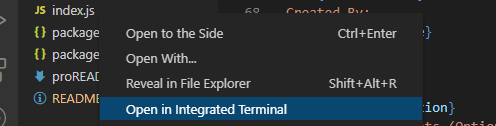
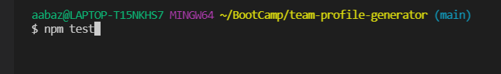

# <ins>Team Profile Generator</ins>

## Description
An app that allows you to create an HTML page based on user input in the integrated terminal. The team consists of a mandatory manager, as well as any number of engineers and interns.
## <ins>Table of Contents</ins>
- [Installation](#installation)
- [Usage](#usage)
- [License](#license)
- [Contributions](#contribute)
- [Test](#test)
- [Questions](#questions)

## <ins>Installation</ins>
Open the integrated terminal on the index.js file

Type "npm i" in the integrated terminal(if all the files do not install, attempt it again)

Type in "node index.js" to allow the prompts to populate. Answer the prompts and once complete, the README will save the corresponding answers to the appropriate location in the template

## <ins>Usage</ins>
Run the application in the integrated terminal by typing "node index.js". Fill out the manager and once prompted with a choice to add another member; either choose an Engineer, Intern or finish your team by selecting None.

Example of the page created with the application:

## <ins>License</ins>
This project is covered under MIT
## <ins>How to Contribute
Feel free to fork and use at will!
## <ins>Tests</ins>
Type "npm test" in the integrated terminal for a list of tests

## <ins>Questions</ins>
Contact the creator of Team Profile Generator at aabazary@gmail.com. Github link: https://github.com/aabazary
